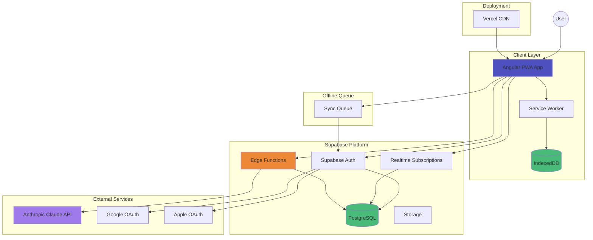
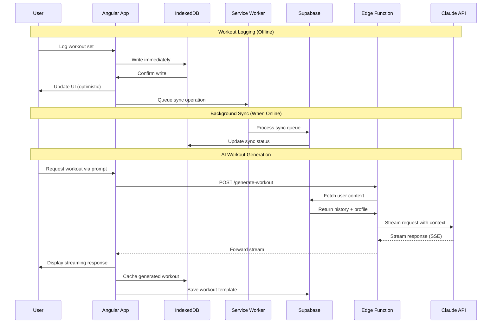

# Trakn Implementation Plan

## Executive Summary

**Timeline:** 2-3 weeks for MVP  
**Architecture:** Offline-first PWA with Supabase backend and Anthropic Claude AI agent  
**Cost Projection:** $10-30/month at 100 users (Supabase free tier + Claude API usage)  
**Repository:** Monolithic repository with organized workspace structure

## High-Level Architecture



## System Data Flow



## Monorepo Structure

```
trakn/
├── .github/
│   └── workflows/
│       ├── frontend-deploy.yml        # Vercel deployment
│       └── supabase-deploy.yml        # Edge functions deployment
├── apps/
│   └── web/                           # Angular application
│       ├── src/
│       │   ├── app/
│       │   │   ├── core/              # Singleton services, guards, interceptors
│       │   │   │   ├── services/
│       │   │   │   │   ├── auth.service.ts
│       │   │   │   │   ├── offline-sync.service.ts
│       │   │   │   │   ├── supabase.service.ts
│       │   │   │   │   └── ai-agent.service.ts
│       │   │   │   ├── guards/
│       │   │   │   │   └── auth.guard.ts
│       │   │   │   ├── interceptors/
│       │   │   │   │   └── offline.interceptor.ts
│       │   │   │   └── db/
│       │   │   │       └── indexed-db.service.ts
│       │   │   ├── shared/            # Shared components, directives, pipes
│       │   │   │   ├── components/
│       │   │   │   │   ├── timer/
│       │   │   │   │   ├── exercise-selector/
│       │   │   │   │   └── streaming-text/
│       │   │   │   ├── directives/
│       │   │   │   └── pipes/
│       │   │   │       └── time-format.pipe.ts
│       │   │   ├── features/          # Feature modules
│       │   │   │   ├── auth/
│       │   │   │   │   ├── login/
│       │   │   │   │   ├── register/
│       │   │   │   │   └── auth.routes.ts
│       │   │   │   ├── workouts/
│       │   │   │   │   ├── workout-list/
│       │   │   │   │   ├── workout-builder/
│       │   │   │   │   ├── workout-detail/
│       │   │   │   │   ├── services/
│       │   │   │   │   │   └── workout.service.ts
│       │   │   │   │   └── workouts.routes.ts
│       │   │   │   ├── workout-session/
│       │   │   │   │   ├── session-active/
│       │   │   │   │   ├── set-logger/
│       │   │   │   │   ├── services/
│       │   │   │   │   │   └── session.service.ts
│       │   │   │   │   └── session.routes.ts
│       │   │   │   ├── ai-generator/
│       │   │   │   │   ├── prompt-input/
│       │   │   │   │   ├── workout-preview/
│       │   │   │   │   ├── services/
│       │   │   │   │   │   └── ai-generator.service.ts
│       │   │   │   │   └── ai-generator.routes.ts
│       │   │   │   ├── history/
│       │   │   │   │   ├── session-list/
│       │   │   │   │   ├── session-detail/
│       │   │   │   │   ├── services/
│       │   │   │   │   │   └── history.service.ts
│       │   │   │   │   └── history.routes.ts
│       │   │   │   ├── training-plans/
│       │   │   │   │   ├── plan-list/
│       │   │   │   │   ├── plan-builder/
│       │   │   │   │   ├── plan-calendar/
│       │   │   │   │   ├── services/
│       │   │   │   │   │   └── plan.service.ts
│       │   │   │   │   └── plans.routes.ts
│       │   │   │   └── profile/
│       │   │   │       ├── profile-edit/
│       │   │   │       ├── equipment-setup/
│       │   │   │       └── profile.routes.ts
│       │   │   ├── app.component.ts
│       │   │   ├── app.config.ts
│       │   │   └── app.routes.ts
│       │   ├── assets/
│       │   │   ├── icons/
│       │   │   └── exercises/         # Exercise images/videos (future)
│       │   ├── environments/
│       │   │   ├── environment.ts
│       │   │   └── environment.prod.ts
│       │   ├── styles/
│       │   │   └── styles.css
│       │   ├── index.html
│       │   ├── main.ts
│       │   └── manifest.webmanifest
│       ├── angular.json
│       ├── package.json
│       ├── tailwind.config.js
│       ├── tsconfig.json
│       └── tsconfig.app.json
├── supabase/
│   ├── functions/                     # Edge Functions
│   │   ├── generate-workout/
│   │   │   ├── index.ts
│   │   │   └── prompt-builder.ts
│   │   ├── generate-plan/
│   │   │   ├── index.ts
│   │   │   └── plan-generator.ts
│   │   └── _shared/
│   │       ├── anthropic.ts           # Anthropic client wrapper
│   │       ├── context-assembly.ts    # User context fetching
│   │       └── cors.ts                # CORS headers
│   ├── migrations/                    # Database migrations
│   │   ├── 20250101000000_initial_schema.sql
│   │   ├── 20250102000000_rls_policies.sql
│   │   ├── 20250103000000_seed_exercises.sql
│   │   └── 20250104000000_indexes.sql
│   ├── seed.sql                       # Seed data (exercises)
│   └── config.toml                    # Supabase configuration
├── packages/
│   └── shared/                        # Shared TypeScript types
│       ├── src/
│       │   ├── types/
│       │   │   ├── workout.types.ts
│       │   │   ├── exercise.types.ts
│       │   │   ├── session.types.ts
│       │   │   ├── plan.types.ts
│       │   │   ├── user.types.ts
│       │   │   └── ai.types.ts
│       │   ├── constants/
│       │   │   ├── muscle-groups.ts
│       │   │   ├── equipment.ts
│       │   │   └── exercise-library.ts
│       │   ├── validators/
│       │   │   └── workout.validators.ts
│       │   └── index.ts
│       ├── package.json
│       └── tsconfig.json
├── scripts/
│   ├── setup-supabase.sh              # Initialize Supabase project
│   ├── seed-exercises.ts              # Exercise library seeding
│   └── generate-types.sh              # Generate types from Supabase
├── docs/
│   ├── architecture.md
│   ├── database-schema.md
│   ├── offline-strategy.md
│   └── ai-prompts.md
├── .gitignore
├── .env.example
├── package.json                       # Root package.json for monorepo
├── pnpm-workspace.yaml               # PNPM workspace configuration
├── turbo.json                        # Turborepo configuration (optional)
└── README.md
```

## Project Structure Rationale

### Monorepo Organization

**Root Level:**
- Single `package.json` for shared dependencies and workspace scripts
- `pnpm-workspace.yaml` for efficient package management across workspace
- Environment variables template (`.env.example`)

**Apps Directory:**
- Contains the Angular web application as the primary deployable artifact
- Isolated configuration and dependencies specific to the frontend
- Clear separation from backend code

**Supabase Directory:**
- Edge Functions organized by feature (workout generation, plan generation)
- `_shared` directory for common utilities (Anthropic client, CORS, context assembly)
- Migrations tracked in version control for reproducible database schema
- Seed data for exercise library

**Packages Directory:**
- `shared` package for TypeScript types used across frontend and Edge Functions
- Ensures type safety between client and server
- Constants for muscle groups, equipment types, and exercise library
- Validators that can be used in both client-side and server-side validation

**Scripts Directory:**
- Setup and maintenance scripts
- Type generation from Supabase schema
- Exercise library seeding utilities

### Module Organization Strategy

**Angular Feature Structure:**
Each feature module follows a consistent pattern:
- **Components:** UI components specific to the feature
- **Services:** Business logic and data management for the feature
- **Routes:** Lazy-loaded route definitions
- **Types:** Feature-specific TypeScript interfaces (extends shared types)

**Core vs. Shared:**
- **Core:** Singleton services (auth, offline sync, database)
- **Shared:** Reusable components, directives, and pipes used across features

**Benefits:**
- Clear feature boundaries reduce cognitive load
- Lazy loading improves initial bundle size
- Easy to locate and modify specific functionality
- Type sharing prevents drift between frontend and backend

## Technology Stack

### Core Technologies
- **Frontend:** Angular 20 + TailwindCSS 4 (PWA-enabled)
- **Backend:** Supabase (PostgreSQL, Auth, Edge Functions, Storage)
- **AI:** Anthropic Claude Sonnet 4 via Supabase Edge Functions
- **Offline:** Service Workers + IndexedDB (via Dexie.js)
- **Deployment:** Vercel (frontend) + Supabase hosted (us-east-1)

### Additional Architectural Components
- **RxJS** for state management and offline sync orchestration
- **Dexie.js** for IndexedDB abstraction (type-safe, Promise-based)
- **Angular PWA** module for service worker and manifest generation
- **Supabase Realtime** for multi-device sync (when online)
- **PNPM** for efficient monorepo package management
- **Turborepo** (optional) for build caching and task orchestration

## Architectural Decisions

### 1. Offline-First Architecture (Critical for Gym Use)

**Pattern:** Local-first with background synchronization

```
User Action → IndexedDB (immediate) → UI Update (optimistic)
                    ↓
            Background Sync Queue
                    ↓
            Supabase (when online)
```

**Key Decisions:**
- All workout data writes go to IndexedDB first
- Read operations prefer local data, fall back to Supabase
- Sync queue tracks pending operations (creates, updates, deletes)
- Conflict resolution: last-write-wins with timestamp comparison
- Service worker intercepts API calls when offline

**Rationale:** Gyms have notoriously poor connectivity. Users must be able to log entire workouts offline without data loss.

### 2. AI Agent Architecture

**Implementation:** Supabase Edge Functions → Anthropic Claude API

```
Angular App → Edge Function (streaming) → Claude API
                    ↑
            User context from PostgreSQL
            (history, equipment, preferences)
```

**Key Decisions:**
- Edge Functions keep API keys secure, handle context assembly
- Streaming responses via Server-Sent Events (SSE)
- Context window optimization: last 10 workouts + user profile
- Caching: Store generated workouts to avoid regeneration
- Model: Claude Sonnet 4 (balance of cost/capability)

**Cost Optimization:**
- Cache workout templates (muscle group + equipment combinations)
- Reuse similar workouts with minor variations
- At 100 users doing 3 AI workouts/week: ~$15-25/month

**Rationale:** Edge Functions provide serverless scaling, keep secrets secure, and handle context assembly without exposing implementation to client.

### 3. Data Model

**PostgreSQL Schema:**

```sql
-- Users (managed by Supabase Auth)
-- auth.users table

-- User profiles
profiles (
  id uuid PRIMARY KEY REFERENCES auth.users,
  equipment_available text[], -- ['barbell', 'dumbbells', 'bench']
  training_frequency integer, -- workouts per week
  created_at timestamp,
  updated_at timestamp
)

-- Exercise library
exercises (
  id uuid PRIMARY KEY,
  name text NOT NULL,
  muscle_groups text[], -- ['chest', 'triceps']
  equipment_required text[], -- ['barbell', 'bench']
  description text,
  created_at timestamp
)

-- Workouts (templates and AI-generated)
workouts (
  id uuid PRIMARY KEY,
  user_id uuid REFERENCES auth.users,
  name text NOT NULL,
  description text,
  source text, -- 'custom' | 'ai_generated'
  ai_prompt text, -- original prompt if AI-generated
  created_at timestamp,
  updated_at timestamp
)

-- Workout exercises (structure)
workout_exercises (
  id uuid PRIMARY KEY,
  workout_id uuid REFERENCES workouts,
  exercise_id uuid REFERENCES exercises,
  position integer, -- order in workout
  target_sets integer,
  target_reps integer, -- or rep range
  rest_seconds integer,
  notes text
)

-- Workout sessions (actual logged workouts)
workout_sessions (
  id uuid PRIMARY KEY,
  user_id uuid REFERENCES auth.users,
  workout_id uuid REFERENCES workouts NULL, -- null if ad-hoc
  started_at timestamp,
  completed_at timestamp,
  notes text,
  synced boolean DEFAULT false -- offline sync flag
)

-- Session sets (actual performance)
session_sets (
  id uuid PRIMARY KEY,
  session_id uuid REFERENCES workout_sessions,
  exercise_id uuid REFERENCES exercises,
  set_number integer,
  reps integer,
  weight numeric(6,2), -- pounds or kg
  completed boolean,
  notes text
)

-- Multi-week training plans
training_plans (
  id uuid PRIMARY KEY,
  user_id uuid REFERENCES auth.users,
  name text NOT NULL,
  description text,
  weeks integer,
  created_at timestamp
)

-- Plan schedule
plan_workouts (
  id uuid PRIMARY KEY,
  plan_id uuid REFERENCES training_plans,
  workout_id uuid REFERENCES workouts,
  week_number integer,
  day_number integer, -- 1-7
  notes text
)
```

**IndexedDB Schema (mirrors Supabase for offline):**
- Stores same structure locally
- Includes `_localId` for offline-created records
- Tracks `_syncStatus` (pending, synced, conflict)

### 4. State Management Strategy

**Pattern:** Service layer with RxJS Observables

```typescript
// Offline-aware service pattern
@Injectable()
export class WorkoutService {
  private db: Dexie; // IndexedDB
  private supabase: SupabaseClient;
  
  getWorkouts$(): Observable<Workout[]> {
    // Combine local + remote, prefer local for speed
    return combineLatest([
      this.getLocalWorkouts$(),
      this.isOnline$ ? this.getRemoteWorkouts$() : of([])
    ]).pipe(
      map(([local, remote]) => this.mergeWorkouts(local, remote))
    );
  }
  
  createWorkout(workout: Workout): Observable<Workout> {
    // Write to IndexedDB immediately
    // Queue for sync when online
    // Return optimistic result
  }
}
```

**Rationale:** RxJS handles async complexity, provides reactive updates, and simplifies online/offline state management.

## Development Phases

### Phase 1: Foundation (Days 1-4)
**Goal:** Auth, basic UI shell, database setup

**Tasks:**
1. Monorepo setup (PNPM workspaces)
2. Angular project setup with PWA support
3. TailwindCSS 4 configuration
4. Shared types package initialization
5. Supabase project creation (us-east-1)
6. Auth implementation (email/password, Google, Apple)
7. Database schema deployment
8. Basic routing structure (home, workouts, history, profile)
9. IndexedDB setup with Dexie.js
10. Service worker configuration

**Deliverable:** Users can sign in and see empty app shell

### Phase 2: Workout Creation & Logging (Days 5-9)
**Goal:** Core functionality without AI

**Tasks:**
1. Exercise library (seed ~50 common exercises)
2. Custom workout builder UI
3. Workout CRUD operations (offline-first)
4. Workout execution flow
5. Set logging interface (simple, fast input)
6. Timer component for rest periods
7. Workout history view
8. Sync queue implementation

**Deliverable:** Users can create workouts, log sessions, view history (all offline-capable)

### Phase 3: AI Agent Integration (Days 10-14)
**Goal:** AI workout generation with streaming

**Tasks:**
1. Supabase Edge Function for Claude API
2. Prompt engineering (workout generation)
3. Context assembly (user history, equipment, recent training)
4. Streaming UI component (typewriter effect)
5. Save/edit AI-generated workouts
6. Multi-week plan generation
7. Error handling and fallbacks

**Deliverable:** Users can generate workouts via natural language

### Phase 4: Polish & Testing (Days 15-21)
**Goal:** Production-ready MVP

**Tasks:**
1. Offline/online transition testing
2. Multi-device sync validation
3. UI polish and responsive design refinement
4. Loading states and error messages
5. Onboarding flow
6. Performance optimization (lazy loading, bundle size)
7. PWA manifest and icons
8. Basic analytics (Supabase or simple event tracking)

**Deliverable:** Production deployment to Vercel

## AI Agent Implementation Details

### Edge Function Structure

```typescript
// supabase/functions/generate-workout/index.ts
import Anthropic from '@anthropic-ai/sdk';

Deno.serve(async (req) => {
  const { prompt, userId } = await req.json();
  
  // Fetch user context
  const context = await assembleUserContext(userId);
  
  // Build system prompt
  const systemPrompt = buildWorkoutGenerationPrompt(context);
  
  // Stream from Claude
  const stream = await anthropic.messages.stream({
    model: 'claude-sonnet-4-20250514',
    max_tokens: 2000,
    system: systemPrompt,
    messages: [{ role: 'user', content: prompt }]
  });
  
  // Return SSE stream
  return new Response(stream.toReadableStream(), {
    headers: { 'Content-Type': 'text/event-stream' }
  });
});
```

### Context Assembly Strategy

```typescript
async function assembleUserContext(userId: string) {
  // Last 10 workouts for variety
  const recentWorkouts = await getRecentWorkouts(userId, 10);
  
  // Training frequency
  const frequency = await getTrainingFrequency(userId);
  
  // Available equipment
  const equipment = await getUserEquipment(userId);
  
  // Muscle groups trained in last 7 days
  const recentMuscleGroups = extractMuscleGroups(recentWorkouts);
  
  return {
    recentWorkouts: summarizeWorkouts(recentWorkouts),
    frequency,
    equipment,
    recentMuscleGroups,
    lastWorkoutDate: recentWorkouts[0]?.date
  };
}
```

### Prompt Structure

```typescript
function buildWorkoutGenerationPrompt(context: UserContext): string {
  return `You are a strength training coach generating workout plans.

User Context:
- Equipment: ${context.equipment.join(', ')}
- Training Frequency: ${context.frequency}x per week
- Recent Training: ${context.recentMuscleGroups.join(', ')}
- Last Workout: ${context.lastWorkoutDate}

Generate workouts in this JSON structure:
{
  "name": "Workout name",
  "description": "Brief description",
  "exercises": [
    {
      "name": "Exercise name",
      "sets": 3,
      "reps": "8-10",
      "rest_seconds": 90,
      "notes": "Form cues"
    }
  ]
}

Principles:
- Balance push/pull movements
- Avoid training same muscle groups on consecutive days
- Progress through compound → isolation exercises
- Match equipment availability
- 45-60 minute workouts`;
}
```

## Offline Sync Strategy

### Sync Queue Implementation

```typescript
interface SyncOperation {
  id: string;
  type: 'create' | 'update' | 'delete';
  table: string;
  data: any;
  timestamp: number;
  retries: number;
}

class SyncQueue {
  async add(operation: SyncOperation) {
    await this.db.syncQueue.add(operation);
    this.triggerSync();
  }
  
  async processQueue() {
    const operations = await this.db.syncQueue
      .orderBy('timestamp')
      .toArray();
    
    for (const op of operations) {
      try {
        await this.executeOperation(op);
        await this.db.syncQueue.delete(op.id);
      } catch (error) {
        op.retries++;
        if (op.retries > 5) {
          // Log conflict, notify user
          await this.handleSyncFailure(op);
        }
      }
    }
  }
}
```

## Security Considerations

### Row Level Security (RLS) Policies

```sql
-- Workouts: Users can only see their own
CREATE POLICY "Users can view own workouts"
  ON workouts FOR SELECT
  USING (auth.uid() = user_id);

CREATE POLICY "Users can create own workouts"
  ON workouts FOR INSERT
  WITH CHECK (auth.uid() = user_id);

-- Session data: Strict user isolation
CREATE POLICY "Users can view own sessions"
  ON workout_sessions FOR SELECT
  USING (auth.uid() = user_id);
```

### API Security
- Edge Functions validate JWT tokens automatically
- Rate limiting via Supabase (built-in)
- Claude API key never exposed to client

## Testing Strategy (Given MVP Timeline)

**Priority Testing:**
1. Offline → Online sync validation (manual testing)
2. Multi-device workout logging (test account)
3. AI agent response quality (prompt testing)
4. Auth flows (email, Google, Apple)

**Deferred for Post-MVP:**
- Automated E2E tests
- Unit test coverage
- Load testing

## Risk Mitigation

| Risk | Impact | Mitigation |
|------|--------|-----------|
| Offline sync conflicts | Medium | Last-write-wins with timestamp; rare with 1-5 users |
| Claude API costs exceed budget | Low | Cache workouts; monitor usage in first month |
| PWA installation issues on iOS | Medium | Test on actual iOS devices; have fallback web experience |
| Complex offline state management | High | Start simple; iterate based on real usage patterns |

## Post-MVP Considerations

**Phase 5 (Weeks 4-8):**
- Exercise video/image library
- Advanced plan templates
- Workout templates marketplace (user-created)
- Export workout history (CSV)
- Dark mode

**Technical Debt to Address:**
- Comprehensive error boundaries
- Automated testing suite
- Performance monitoring
- Backup/restore functionality

## Open Questions for Clarification

1. **Exercise Library:** Should we seed with a curated list, or allow users to create custom exercises from day 1?
2. **Units:** Imperial (lbs) only, or support metric (kg) with user preference?
3. **AI Feedback Loop:** Should the AI agent learn from workout completion patterns (did user finish workout, modify sets, etc.)?
4. **History Retention:** Keep all workout history indefinitely, or archive after X months?

## Next Steps

1. **Confirm this plan** addresses your requirements
2. **Answer open questions** above
3. **Begin Phase 1** - Scaffold the Angular project with proper PWA + offline configuration
4. **Set up Supabase project** - SQL schema and RLS policies ready to execute
